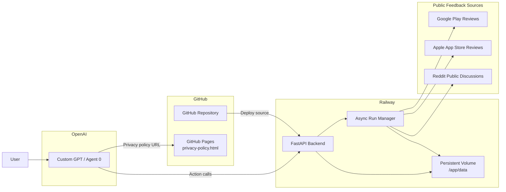
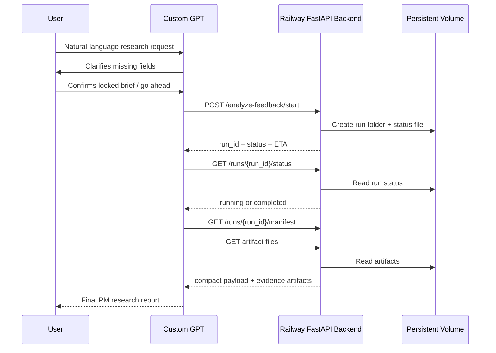
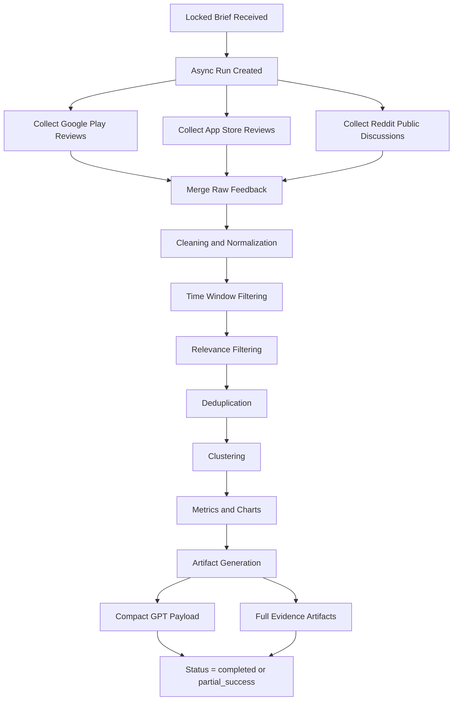
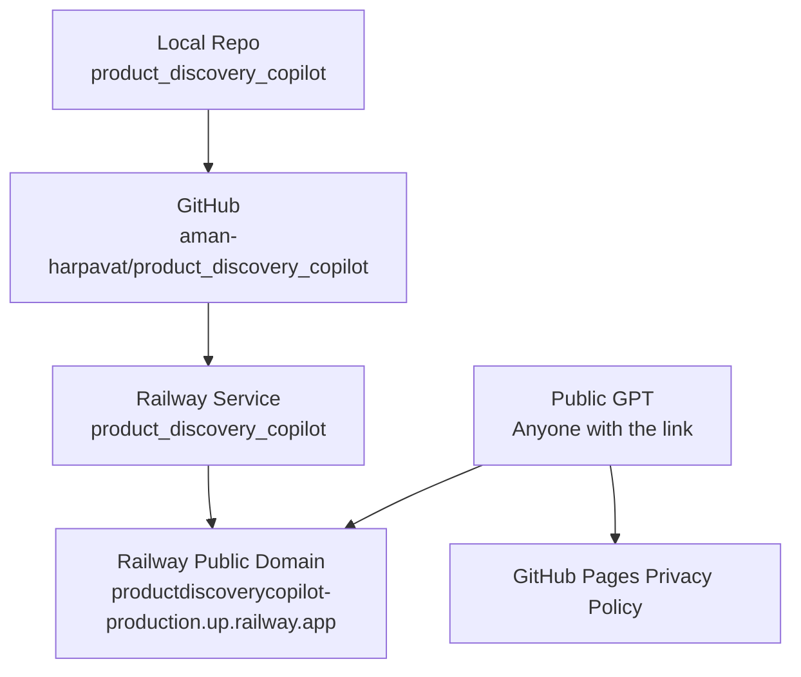

# High-Level Architecture Diagram

This document shows the deployed high-level architecture of the AI Product Discovery Copilot, including the public GPT, hosted backend, storage, and external source dependencies.

## 1. System Overview



## 2. GPT-to-Backend Interaction



## 3. Backend Evidence Pipeline



## 4. Stored Data

```mermaid
flowchart LR
    subgraph VOL[Railway Persistent Volume]
        RUNS[data/runs/{run_id}/]
        STATUS[_run_status.json]
        LOG[run.log]
        RAW[all_feedback_raw.csv]
        CLEAN[all_feedback_clean.csv]
        CLUSTERS[all_clusters*.json / csv]
        ARTIFACTS[charts_data.json<br/>research_question_coverage.json<br/>segment_evidence.json<br/>quality_diagnostics.json<br/>etc.]
    end

    RUNS --> STATUS
    RUNS --> LOG
    RUNS --> RAW
    RUNS --> CLEAN
    RUNS --> CLUSTERS
    RUNS --> ARTIFACTS
```

## 5. Deployment View



## 6. Notes

- The GPT is the PM reasoning layer.
- The backend is the evidence preparation layer.
- Public feedback is collected live from supported sources.
- Run artifacts are stored on the Railway volume and auto-deleted after the retention window.
- GitHub Pages hosts the public privacy policy required for GPT Actions.
